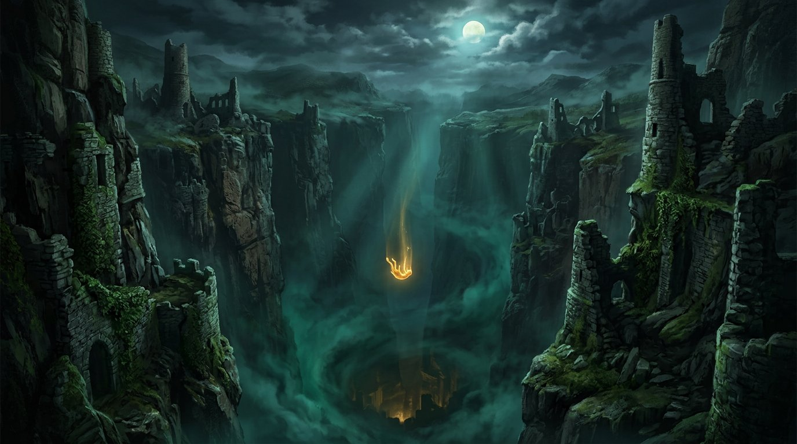

# Irish Fall ☘️

An endless, dark **browser game** — and the website to showcase it.

You are the last of the lost: a sliver of golden light tumbling down a
bottomless chasm beneath Ireland. Dodge the ruins of a drowned kingdom,
gather cursed gold, snatch a four-leaf clover for one free save, and
outrun the banshees that hear you falling. How deep can you go?



## Play it

Just open [`index.html`](index.html) in a browser (or serve the folder):

```bash
python3 -m http.server 8123
# → http://localhost:8123
```

Everything runs client-side: HTML5 Canvas + vanilla JavaScript, **zero
dependencies**, no build step, no account, no tracking.

### Controls

| Action            | Input                              |
| ----------------- | ---------------------------------- |
| Steer             | `←` `→` / `A` `D`, or drag         |
| Start / retry     | `Space`                            |
| Pause             | `P`                                |
| Restart           | `R`                                |
| Sound on / off    | `M`                                |

## Downloads

- **Play in browser** — the live demo is embedded on the homepage.
- **Offline copy** — [`downloads/irish-fall-demo.html`](downloads/irish-fall-demo.html)
  is a single self-contained HTML file (game code inlined, works fully
  offline). Rebuild it after editing the game with:
  ```bash
  node scripts/build-offline.js
  ```
- **Source code** — this repository.

## Repository layout

```
index.html                  Game showcase / download page (dark & cinematic)
css/style.css               All page styling
js/game.js                  The game engine (endless-faller demo)
js/main.js                  Page behaviours (nav, lightbox, reveals)
assets/                     Favicon + key art / screenshots
downloads/irish-fall-demo.html   Single-file offline build (generated)
scripts/build-offline.js    Inlines js/game.js into the offline file
scripts/smoke.js            Dev smoke test (fake DOM + canvas in Node)
```

## Development

No build needed for the page. Sanity helpers:

```bash
node --check js/game.js && node --check js/main.js   # syntax
node scripts/smoke.js                                # ~10s headless gameplay simulation
node scripts/build-offline.js                        # regenerate offline download
npm test                                             # runs the smoke test
npm run serve                                        # local server on :8123
```

## License

MIT — see [LICENSE](LICENSE). Artwork in `assets/img` is AI-generated for
this demo project. Fall responsibly.
